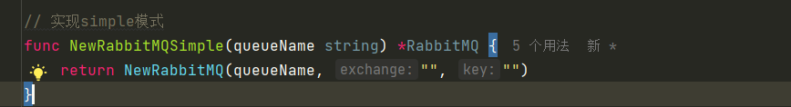

# rabbitMQ的五种模式

1. simple模式
2. work模式
3. pub/sub模式
4. routing模式
5. topic模式

## 1.simple模式

这是最简单的模式了。也就是由生产者将消息送到队列里，然后由消费者到消息队列里来取。
只需要指定一个队列名称

生产者：创建队列->发送消息
消费者：创建队列->接收消息

## 2.work模式

work模式其实和simple用的是一套逻辑代码, work模式是可以有多个消费者的，work模式起到一个负载均衡的作用。
比如两个消费者：也就是一个消费者只消费奇数，而另外一个则只消费偶数。
一个消息只能被一个消费者消费。

## 3.pub/sub模式

由生产者将消息发送到exchange(交换机）里，然后exchange通过一系列的规则发送到队列上，然后由绑定对应的消费者进行消息。
定义exchange时，其kind类型一定要是"fanout",这样才是广播类型
生产者发送广播是实时的，消费者需要提前等待生产者发生消息，这个又叫订阅发布，收音机模式，就像只有收音机打开了才能听到锁定的FM频道，但是如果在节目开始一段时间，再打开收音机的话，之前的节目就收听不到了。即订阅之前的消息都是收不到的。

生产者：创建交换机->发布消息
消费者：创建交换机->创建队列->队列绑定到交换机中->消费消息

## 4.routing模式

相对比订阅模式就多了一个routingKey的设计，也是通过这个来指定消费者的。
创建exchange的kind需要是"direct",不然就不是roting模式了

## 5.topic模式

这个模式也是在routing模式上进一步升华而来，通过上面的介绍我们知道routing模式最大的特点是可以从生产端来指定消费端来消费消息，是通过routingKey来指定的。
那么我们可不可以通过一定的规则来指定呢?比如用通配符来的指定，当然这个也是可以的。这也就是topic模式最大的特点了。
topic模式也是在routing的模式上演化而来。不同的是我们以通配符的方式来指定我们的消费者。
创建exchange的kind需要是"topic"
具体理解可以结合案例来理解

## 总结

消息丢失，消息堆积，重复消费，顺序消费？

